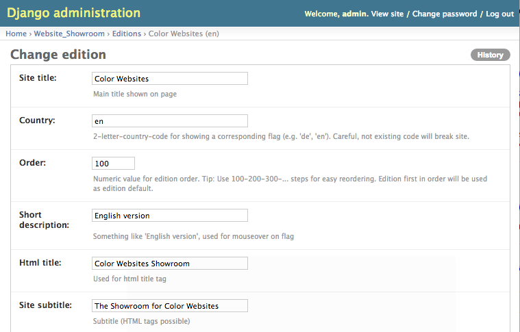
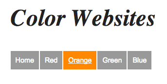
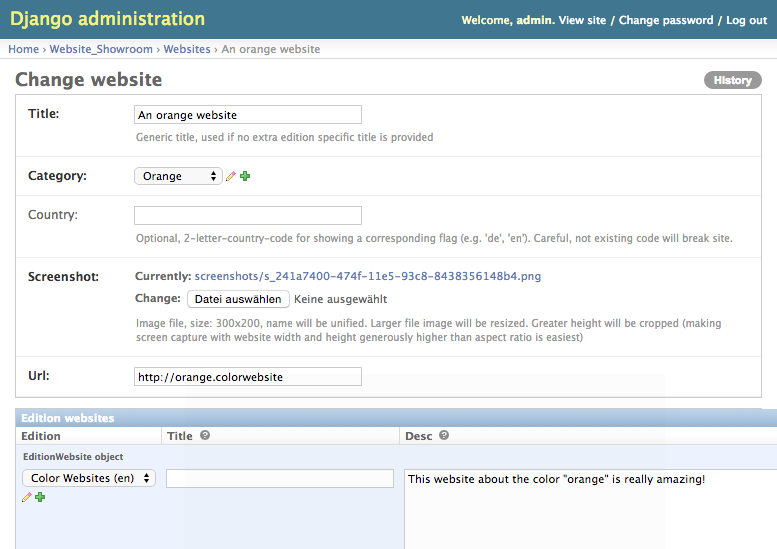
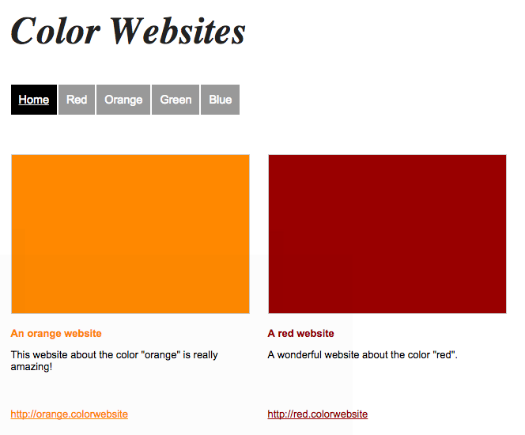

====================
Create your Showroom
====================

After you have installed and configured the library you can actually start to create your showroom of websites.

Add an Edition
==============
A website showroom consists of one or more ``editions``, representing the version of the showroom for a specific country/language.

You can add en edition of the site in the ``Django admin``. For creating an edition, open an edition form and
follow the instructions close to the form fields.

After adding an edition entry, you should for the first time be able to run the front-end website and see the
basic layout of the site.

Create Categories
=================
Categories will show as the main navigation of the showroom. You have to explicitly name the edition(s) a category
should be displayed/associated. This allows for having (slightly) different categories for different editions.

Add your Websites
=================
Now to the actual fun: look for websites about the topic you would want to make the website showroom about and
add them to your site via the ``Django admin``.

You can then see your websites in the editions you added them to (language/country editions can be switched via the flags
in the top-right corner of the showroom website).

And that's it.

Now add your own stuff! :-)